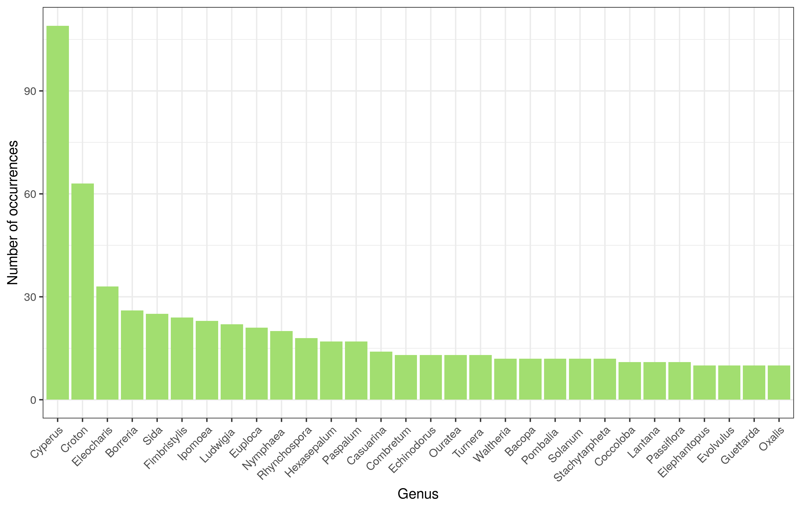

## Introdution
Collecting information of the existence of species in specific locations is critical for determining its diversity and richness. Which species are found in a specific location? Which species are on risk of extinction? Why are there more species in this or that type of vegetation? All of these and other questions are present in the day-to-day work of ecologist and botanist researchers, and it is critical to have this information documented and available in order to answer them; this is where herbariums come into play. A herbarium is a collection of pressed, dried, and organized plant specimens based on taxonomic classification. The herbarium contains flora diversity registers and can be used as a foundation for many scientific studies. Having these digital collections is important for making them more accessible not only to scientists but also to the general public, as well as for protecting these collections.

The database used in this work contains the different species found in the city of Caucaia located in the Brazilian state of Ceará. The city has a coastal extension of 44 kilometers, where part of it is in a area of environmental protection. The vegetation formations of the city includes Coastal Zone Vegetation Complex, Shrubby Caatinga and Cerrado [@ipece]. In this short project for the discipline of Computational Methods in the Serrapilheira/ICTP-SAIFR Training Program in Quantitative Biology and Ecology, I plan to do a initial data analysis, following some steps to clean the database and organize it. Subsequently, I would like to calculate the genus richness of the city and look at how the richness of species differ depending on vegetation type.

## Database

This dataset includes all plants register in a herbarium database collected in the municipality of Caucaia in Ceará. Data used for this project was compilation of the datasets collected using the Specieslink, GBif and reflora  database. The dataset contains 28 columns, which some of them are the following: *colecao*: the herbarium where the dried plant was deposited, *nº.tombo*: identifier number of herbarium specimen, taxonomic classification, where we have *filo*: phylum, *classificacao*: class, *familia*: family, *genero*: genus, *especie*: species and *sub.especies*: sub-species; *nome.popular*: common name, *status.de.conservacao*: the conservation status, *pais*: country, *estado*: state, *municipio*: municipality, *tipo.de.vegetacao*: the type of vegetation and *tipo.de.substrato*: substrate where the species is found. We also have *latitude.decimal*, *longitude.decimal*: the geographic coordinates of the collection site. 

## Results and Discussion

I started checking for the richness in each specific vegetation. 

Following that we have the 

The number of herbariums in the dataset

## Conclusion
This short project was helpful to put in practice the topics discussed in the class, especially around the good practices that should be used when creating R projects. While working with a biodiversity database, it was possible to see the common problems with these databases regarding errors on collection names, manual typos and more. It was also possible to see the importance of working closely with a botanist and ecologist. The preparation of the database took most of the time while working on the project. This step of the data analysis is extremely important to pay close attention, since any erroneous cleaning decisions can result in inaccurate conclusions. Finally, for future work I would like to calculate richness considering the different vegetation and substrates. 

## Acknowledgements
Andrieli Lima for the helpful discussions.

## References

 

